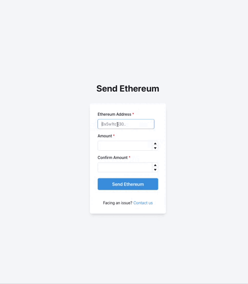

## Problem 1

Refer to `problem1/solution/js`

## Problem 2

Refer to `problem2/fancyform/`



## Problem 4

Refer to `problem4/retrieve-holders.ts`

```shell
problem4 % ts-node retrieve-holders.ts

0xb5d4f343412dc8efb6ff599d790074d0f1e8d430 20127483.02030024
0x0020c5222a24e4a96b720c06b803fb8d34adc0af 0.0
0xd1d8b2aae2ebb2acf013b803bc3c24ca1303a392 57167.74204492

```

## Problem 5

Refer to `problem5/`

Contract Address: `0x8C436aeF7370E7008De00ee81F493EA7341B3cDF`

```shell
problem5 % ts-node test/test.js


[
  {
    token: '0x7a8351d0c15C830Cdb96F40D0fEe042C1D5012F2',
    balance: BigNumber { _hex: '0x056bc75e2d63100000', _isBigNumber: true }
  },
  {
    token: '0xa33F5980c387603cFF95747cbE0516b2C47f31F8',
    balance: BigNumber { _hex: '0x4563918244f40000', _isBigNumber: true }
  }
]

```

## Problem 7

Refer to `problem7/solution.sql`
